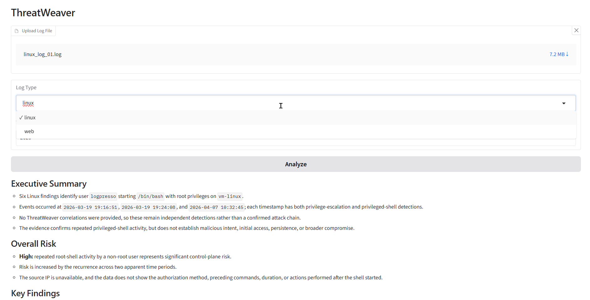
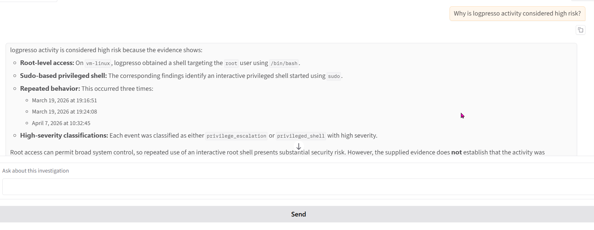

# ThreatWeaver

ThreatWeaver is a Python-based security detection and AI-assisted investigation platform for Linux and web logs.

It parses logs, detects suspicious activity with deterministic rules, correlates related findings, and uses an AI analyst to summarize risk and answer follow-up questions about the current investigation.

## Features

- Linux and web log parsing
- 12 Linux detection rules
- 4 web detection rules
- Cross-finding correlation
- AI-generated security analysis
- Multi-turn investigation chat
- Gradio-based log upload interface

## Architecture

```text
Raw Logs
→ Parser
→ Event
→ Detector
→ Finding
→ Correlation
→ AI Analysis
→ Investigation Chat
Current Detections
Linux
SSH brute force
Password spraying
Privilege escalation
Suspicious privileged shell
Sensitive file access
Account manipulation
Persistence
Suspicious download / execution
Log tampering
Permission changes
Sensitive archive activity
Web
Path traversal
SQL injection
XSS
Sensitive path access
AI Investigation

After analysis, ThreatWeaver can generate:

Risk summary
Key findings
Confirmed correlations
Possible attack scenarios
Investigation steps
Remediation recommendations

Users can then ask follow-up questions while the current investigation context and chat history are preserved in the session.

Tech Stack
Python
OpenAI API
Gradio
PostgreSQL / psycopg
python-dotenv
Run
python -m UI.gradio_app

Open:

http://127.0.0.1:7860
Status
```

## Demo

### Log Analysis


### Investigation Chat


Completed:

Linux + web detection pipeline
Correlation engine
AI security analysis
Session-based multi-turn investigation chat

In progress:

Persistent investigations with PostgreSQL
Windows / Sysmon support
Expanded cross-platform correlation